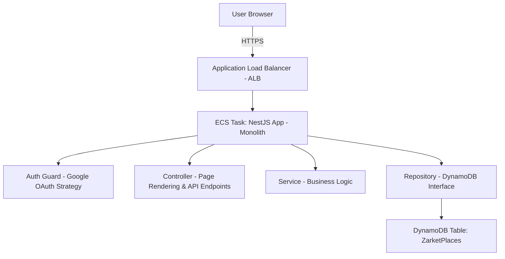

# Zarket Places (직방 마켓플레이스) 통합 상세 설계서

**문서 버전:** 1.1
**작성일:** 2026-02-13
**기반 문서:** `PRD-ai-tools-registry.md`, `ZarketPlace_Design_v0.1.md`
**변경 이력:** v1.1 — 누락 기능 보완, 보안 설계 추가, Star 토글 완성

---

## 1. 개요 및 설계 원칙

### 1.1 프로젝트 정의
사내에 분산된 AI 자산(MCP, Skill, Plugin, Prompt 등)을 중앙에서 검색하고 공유하여 재사용성을 높이는 레지스트리 플랫폼.

### 1.2 핵심 의사결정 (Conflict Resolution: Simplicity First)
두 원본 문서의 상충 내용은 **'구현 단순성'**과 **'MVP 신속 개발'**을 최우선으로 하여 다음과 같이 결정함.

1. **아키텍처 단순화**: Frontend/Backend 분리(Next.js + NestJS) 대신 **NestJS SSR(Monolith)** 방식을 채택.
   - *이유:* 배포 파이프라인 단일화, 네트워크 복잡도 제거, 소규모 사내 도구에 적합.
   - *기술:* NestJS + Handlebars (hbs) + Tailwind CSS.
2. **데이터 접근 단순화**: 복잡한 인덱싱 대신 **DynamoDB Scan** 위주 설계.
   - *이유:* 데이터 양이 수천 건 이하일 때는 Scan이 비용/성능 면에서 문제되지 않으며 개발이 훨씬 빠름.
3. **기능 범위 축소**: 파일 업로드, 슬랙 봇 연동 등은 Phase 2로 이관하고 **'등록, 검색, 1-Click 명령어 복사'**에 집중.
4. **아이템 타입**: MVP에서는 `MCP | Skill | Plugin | Prompt` 4가지만 지원. v0.1에 있던 `Agent`, `Workflow`는 향후 필요 시 추가.
5. **아이템 상태**: PRD의 `published | archived`(공개 여부) 방식을 채택. v0.1의 성숙도(`experimental/stable/deprecated`)는 Phase 2에서 별도 필드로 검토.

---

## 2. 시스템 아키텍처

### 2.1 기술 스택

| 구분 | 기술 | 선정 이유 |
|---|---|---|
| **Framework** | **NestJS** (Node.js) | Backend 로직과 View 렌더링(SSR)을 단일 프레임워크에서 처리 |
| **View Engine** | **HBS (Handlebars)** | NestJS 기본 지원, 러닝 커브가 낮음 |
| **Styling** | **Tailwind CSS** | CDN 방식 혹은 빌드 타임 적용으로 빠른 UI 개발 |
| **Database** | **AWS DynamoDB** | 서버리스, 관리 포인트 최소화 (Single Table Design) |
| **Infra** | **AWS ECS (Fargate)** + ALB | 사내 인프라 표준 준수, 컨테이너 기반 배포 |
| **Auth** | **Google OAuth 2.0** | 사내 계정 연동 (Passport 라이브러리 사용) |

### 2.2 논리적 구조



---

## 3. 데이터 모델 (DynamoDB Single Table)

- **Table Name:** `ZarketPlaces`
- **Partition Key (PK):** String
- **Sort Key (SK):** String
- **GSI:** GSI1 (PK: `GSI1PK`, SK: `GSI1SK`) - Star 목록 등 보조 조회용

### 3.1 Entity 정의

#### A. 아이템 (Asset)
등록된 AI 도구의 메타데이터.

- **PK:** `ITEM#<ulid>` (시간순 정렬이 가능한 ULID 사용 권장)
- **SK:** `METADATA`

**Attributes:**
| 속성 | 타입 | 설명 |
|---|---|---|
| `itemId` | String | ULID |
| `type` | String | `MCP` \| `Skill` \| `Plugin` \| `Prompt` |
| `name` | String | 도구 이름 |
| `description` | String | 목록용 한 줄 설명 |
| `detailDescription` | String | 상세 설명 (Markdown 본문) |
| `tags` | List\<String\> | 태그 ID 목록 (예: `['tag_dev', 'tag_python']`) |
| `status` | String | `published` \| `archived` (기본값: `published`) |
| `installCommand` | String | 1-Click 복사용 (예: `npx ...`), 선택 |
| `githubUrl` | String | 선택 사항 |
| `authorId` | String | Google OAuth sub 값 |
| `authorName` | String | 등록자 이름 |
| `authorEmail` | String | 등록자 이메일 |
| `starCount` | Number | Star 개수 (Atomic Counter로 관리) |
| `viewCount` | Number | 상세 페이지 조회 수 (Atomic Counter) |
| `createdAt` | String | ISO String |
| `updatedAt` | String | ISO String |

#### B. Star (좋아요)
사용자가 어떤 아이템을 Star 했는지 저장.

- **PK:** `USER#<userId>`
- **SK:** `STAR#<itemId>`
- **GSI1PK:** `USER#<userId>` (내 목록 조회용)
- **GSI1SK:** `STAR#<timestamp>` (최신순 정렬용)

**Attributes:**
| 속성 | 타입 | 설명 |
|---|---|---|
| `itemId` | String | 아이템 ID |
| `userId` | String | 사용자 ID |
| `createdAt` | String | ISO String |

#### C. 태그 (Metadata)
필터링을 위한 태그 정보. 관리자가 사전 정의하며, 사용자는 자유 태그를 생성하지 않음.

- **PK:** `TAG_GROUP#<groupId>` (예: `TAG_GROUP#TARGET_TOOL`)
- **SK:** `TAG#<tagId>`

**Attributes:**
| 속성 | 타입 | 설명 |
|---|---|---|
| `tagId` | String | 태그 ID |
| `groupId` | String | 필터 그룹 ID |
| `groupName` | String | 필터 그룹 표시명 |
| `label` | String | 화면 표시 이름 (예: "개발자용", "Python") |
| `order` | Number | 그룹 내 정렬 순서 |

**초기 태그 Seed 데이터:**

| 그룹 ID | 그룹명 | 태그 예시 |
|---|---|---|
| `TYPE` | 타입 | MCP, Skill, Plugin, Prompt |
| `TARGET_TOOL` | 대상 도구 | Claude Code, Cursor, Windsurf, Copilot |
| `USE_CASE` | 용도/역할 | 개발, 검색, PO, QA, DevOps, 디자인 |
| `CATEGORY` | 카테고리 | 결제, 인증, DB, API, 문서화, 테스트, 배포 |

> **Note:** 태그 데이터는 변경 빈도가 낮으므로, 애플리케이션 기동 시 메모리에 로드하고 **TTL 5분 캐싱**으로 관리한다. 태그 변경 시 캐시를 즉시 무효화.

---

## 4. 핵심 기능 상세 (MVP)

### 4.1 인증 (Authentication)
- `Passport-google-oauth20` 전략 사용.
- 로그인 성공 시 JWT를 생성하여 **HttpOnly, Secure, SameSite=Lax** Cookie에 저장.
- 모든 `POST`, `PUT`, `DELETE` 요청은 `@UseGuards(JwtAuthGuard)`로 보호.
- 조회(`GET`)는 비로그인 상태에서도 가능.

**JWT 전략:**
- **Access Token 만료:** 24시간 (사내 도구이므로 긴 TTL 허용).
- **갱신 방식:** 만료 시 Google OAuth 재로그인으로 갱신 (Refresh Token 미사용, 단순화).
- **로그아웃:** Cookie 삭제로 처리.

**CSRF 보호:**
- SSR + Cookie 기반 인증이므로 CSRF 공격에 취약할 수 있음.
- `SameSite=Lax` Cookie 정책으로 기본 방어.
- 상태 변경 API(`POST`, `PUT`, `DELETE`)에는 **CSRF 토큰 검증** 적용 (`csurf` 미들웨어 또는 커스텀 토큰).
- SSR 폼에 hidden field로 CSRF 토큰을 삽입하고, AJAX 요청에는 `X-CSRF-Token` 헤더로 전달.

### 4.2 아이템 목록 및 검색

**구현 방식:**
- DynamoDB Scan으로 전체 아이템 로드 후 애플리케이션 메모리에서 필터링(텍스트 검색, 태그 매칭).
- `status = 'published'`인 아이템만 조회 대상.

**정렬 옵션:**
- `latest` (기본): `createdAt` 역순 — ULID 자체가 시간순이므로 PK 정렬로 대체 가능.
- `stars`: `starCount` 역순.

**Scan 임계치 및 전환 기준:**
- 현재 가정: 아이템 500건 이하, `detailDescription` 평균 2KB → 총 ~1MB 이내.
- **전환 시점:** Scan 응답 시간이 500ms를 초과하거나, 데이터가 400KB(DynamoDB 1회 Scan 제한)를 넘어 페이지네이션이 필요해지는 시점.
- **전환 방안:** DynamoDB `FilterExpression` 적용 → 그래도 부족 시 ElasticSearch 도입 (Phase 2).

**페이지네이션:**
- MVP에서는 전체 로드 후 프론트엔드에서 "더 보기" 방식으로 점진 표시 (클라이언트 사이드 페이징).
- 서버 사이드 커서 기반 페이지네이션은 Scan 전환 시점에 함께 도입.

### 4.3 상세 페이지 & 1-Click 설치
- **Markdown:** `marked` 라이브러리를 사용하여 `detailDescription`을 HTML로 변환하여 렌더링.
- **XSS 방어:** Markdown → HTML 변환 결과에 반드시 **`DOMPurify`**(서버 사이드: `isomorphic-dompurify`)를 적용하여 `<script>`, `onerror` 등 악성 태그/속성 제거.
- **설치 버튼:** 클릭 시 `navigator.clipboard.writeText(installCommand)` 실행하여 사용자 클립보드에 명령어 복사.
- **조회 수:** 상세 페이지 진입 시 `viewCount`를 ADD 1 (Atomic Counter). 동일 사용자 중복 카운트 허용 (MVP 단순화).

### 4.4 Star (좋아요) 토글

Star API는 **토글 방식**으로 동작한다. 기존 Star 존재 여부를 확인한 후 추가 또는 제거.

**Star 추가 (Star가 없을 때):**
1. `USER#<userId>` / `STAR#<itemId>` 항목 `PutItem` (단, `attribute_not_exists(PK)` 조건으로 중복 방지).
2. `ITEM#<itemId>` / `METADATA` 항목의 `starCount`를 `ADD 1`.

**Star 해제 (Star가 있을 때):**
1. `USER#<userId>` / `STAR#<itemId>` 항목 `DeleteItem`.
2. `ITEM#<itemId>` / `METADATA` 항목의 `starCount`를 `ADD -1`.

**데이터 일관성:**
- `TransactWriteItems`를 사용하여 Star 레코드 변경과 `starCount` 업데이트를 **하나의 트랜잭션으로 처리**.
- 트랜잭션이 실패하면 양쪽 모두 롤백되므로 불일치가 발생하지 않음.

> 참고: DynamoDB TransactWriteItems는 같은 테이블 내 최대 100개 항목까지 지원하므로 Star 토글에는 충분.

---

## 5. API 및 라우팅 설계

REST API와 SSR View 라우팅을 혼합하여 사용.

### 5.1 View Controller (HTML 반환)

| Method | Path | 설명 |
|---|---|---|
| `GET` | `/` | 메인 목록 페이지 (검색 쿼리 `?q=`, `?tag=`, `?sort=` 처리) |
| `GET` | `/items/new` | 아이템 등록 폼 (로그인 Guard) |
| `GET` | `/items/:id` | 아이템 상세 페이지 |
| `GET` | `/items/:id/edit` | 수정 폼 (로그인 + 본인 확인 Guard) |
| `GET` | `/my/items` | 내가 등록한 아이템 목록 (로그인 Guard) |
| `GET` | `/my/stars` | 내가 Star한 아이템 목록 (GSI1 조회) |

### 5.2 API Controller (JSON 반환 - 클라이언트 인터랙션용)

| Method | Path | 설명 |
|---|---|---|
| `POST` | `/api/items` | 아이템 등록 처리 |
| `PUT` | `/api/items/:id` | 아이템 수정 처리 |
| `DELETE` | `/api/items/:id` | 아이템 삭제 처리 |
| `POST` | `/api/items/:id/star` | Star 토글 (AJAX 요청용) |
| `GET` | `/api/tags` | 전체 태그 목록 (그룹별, 캐싱 적용) |
| `POST` | `/api/upload` | (Phase 2) 파일 업로드 |

### 5.3 API 에러 응답 형식

모든 API 에러는 다음 JSON 형식으로 반환:

```json
{
  "statusCode": 400,
  "message": "아이템 이름은 필수입니다.",
  "error": "Bad Request"
}
```

| HTTP 코드 | 용도 |
|---|---|
| `400` | 입력 검증 실패 |
| `401` | 인증 필요 (JWT 없음/만료) |
| `403` | 권한 없음 (타인 아이템 수정 시도 등) |
| `404` | 아이템/리소스 없음 |
| `409` | 중복 Star 등 충돌 |

SSR 페이지에서는 에러 발생 시 에러 전용 HBS 템플릿(`error.hbs`)으로 렌더링.

---

## 6. 개발 마일스톤 (4 Weeks MVP)

### Week 1: 환경 구성 및 인증
- NestJS 프로젝트 셋팅, DynamoDB Local 연결.
- Google OAuth 연동 및 JWT 쿠키 발급 구현 (SameSite=Lax, HttpOnly, Secure).
- CSRF 토큰 미들웨어 적용.
- 태그 Seed 데이터 초기화 스크립트 작성.

### Week 2: CRUD 구현
- 아이템 등록/수정/삭제 폼 개발 (Tailwind CSS 적용).
- DynamoDB 연동 (Put, Get, Delete).
- 입력 검증 및 에러 처리 (DTO validation + error.hbs).

### Week 3: 목록 및 상세, Star
- 메인 페이지: 필터링, 정렬(latest/stars), 태그 캐싱.
- 상세 페이지: Markdown 렌더링 + DOMPurify 적용, viewCount 증가.
- Star 토글: TransactWriteItems 기반, 중복 방지.
- 내 아이템/내 Star 목록 페이지.

### Week 4: 통합 테스트 및 QA
- 로컬 환경 통합 테스트 (DynamoDB Local).
- Docker build (ECS Fargate용 Dockerfile 작성).
- 사내 배포 및 동료 피드백 수집.

---

## 7. Docker 및 로컬 개발 환경

### 7.1 docker-compose.yml (로컬 개발용)

DynamoDB Local과 애플리케이션을 함께 띄워 로컬에서 전체 스택을 테스트한다.

```yaml
version: "3.8"

services:
  dynamodb-local:
    image: amazon/dynamodb-local:latest
    container_name: zarketplaces-dynamodb
    ports:
      - "8000:8000"
    command: "-jar DynamoDBLocal.jar -sharedDb -dbPath /home/dynamodblocal/data"
    volumes:
      - dynamodb-data:/home/dynamodblocal/data
    healthcheck:
      test: ["CMD-SHELL", "curl -sf http://localhost:8000/shell/ || exit 1"]
      interval: 10s
      timeout: 5s
      retries: 3

  app:
    build:
      context: .
      dockerfile: Dockerfile
      target: development
    container_name: zarketplaces-app
    ports:
      - "3000:3000"
    environment:
      - NODE_ENV=development
      - DYNAMODB_ENDPOINT=http://dynamodb-local:8000
      - DYNAMODB_REGION=ap-northeast-2
      - DYNAMODB_TABLE_NAME=ZarketPlaces
      - GOOGLE_CLIENT_ID=${GOOGLE_CLIENT_ID}
      - GOOGLE_CLIENT_SECRET=${GOOGLE_CLIENT_SECRET}
      - GOOGLE_CALLBACK_URL=http://localhost:3000/auth/google/callback
      - JWT_SECRET=${JWT_SECRET:-local-dev-secret}
      - APP_URL=http://localhost:3000
    volumes:
      - .:/app
      - /app/node_modules
    depends_on:
      dynamodb-local:
        condition: service_healthy
    command: npm run start:dev

volumes:
  dynamodb-data:
```

### 7.2 Dockerfile (개발 + 프로덕션 Multi-stage)

개발 시에는 `development` 타겟, ECR 배포 시에는 최종 `production` 타겟을 사용한다.

```dockerfile
# ---- Base ----
FROM node:20-alpine AS base
WORKDIR /app
COPY package*.json ./

# ---- Development ----
FROM base AS development
RUN npm ci
COPY . .
CMD ["npm", "run", "start:dev"]

# ---- Build ----
FROM base AS build
RUN npm ci
COPY . .
RUN npm run build

# ---- Production ----
FROM node:20-alpine AS production
WORKDIR /app
COPY package*.json ./
RUN npm ci --only=production && npm cache clean --force
COPY --from=build /app/dist ./dist
COPY --from=build /app/views ./views
COPY --from=build /app/public ./public

ENV NODE_ENV=production
EXPOSE 3000

HEALTHCHECK --interval=30s --timeout=3s --start-period=10s \
  CMD wget -qO- http://localhost:3000/health || exit 1

CMD ["node", "dist/main"]
```

### 7.3 테이블 초기화 스크립트

DynamoDB Local 기동 후 테이블과 Seed 데이터를 생성하는 스크립트.

```bash
#!/bin/bash
# scripts/init-dynamodb.sh

ENDPOINT="http://localhost:8000"
TABLE="ZarketPlaces"

# 테이블 생성
aws dynamodb create-table \
  --endpoint-url $ENDPOINT \
  --table-name $TABLE \
  --attribute-definitions \
    AttributeName=PK,AttributeType=S \
    AttributeName=SK,AttributeType=S \
    AttributeName=GSI1PK,AttributeType=S \
    AttributeName=GSI1SK,AttributeType=S \
  --key-schema \
    AttributeName=PK,KeyType=HASH \
    AttributeName=SK,KeyType=RANGE \
  --global-secondary-indexes \
    '[{
      "IndexName": "GSI1",
      "KeySchema": [
        {"AttributeName": "GSI1PK", "KeyType": "HASH"},
        {"AttributeName": "GSI1SK", "KeyType": "RANGE"}
      ],
      "Projection": {"ProjectionType": "ALL"},
      "ProvisionedThroughput": {"ReadCapacityUnits": 5, "WriteCapacityUnits": 5}
    }]' \
  --provisioned-throughput ReadCapacityUnits=5,WriteCapacityUnits=5 \
  --region ap-northeast-2

echo "✓ Table '$TABLE' created"

# 태그 Seed 데이터
TAGS=(
  '{"PK":{"S":"TAG_GROUP#TYPE"},"SK":{"S":"TAG#mcp"},"tagId":{"S":"mcp"},"groupId":{"S":"TYPE"},"groupName":{"S":"타입"},"label":{"S":"MCP"},"order":{"N":"1"}}'
  '{"PK":{"S":"TAG_GROUP#TYPE"},"SK":{"S":"TAG#skill"},"tagId":{"S":"skill"},"groupId":{"S":"TYPE"},"groupName":{"S":"타입"},"label":{"S":"Skill"},"order":{"N":"2"}}'
  '{"PK":{"S":"TAG_GROUP#TYPE"},"SK":{"S":"TAG#plugin"},"tagId":{"S":"plugin"},"groupId":{"S":"TYPE"},"groupName":{"S":"타입"},"label":{"S":"Plugin"},"order":{"N":"3"}}'
  '{"PK":{"S":"TAG_GROUP#TYPE"},"SK":{"S":"TAG#prompt"},"tagId":{"S":"prompt"},"groupId":{"S":"TYPE"},"groupName":{"S":"타입"},"label":{"S":"Prompt"},"order":{"N":"4"}}'
  '{"PK":{"S":"TAG_GROUP#TARGET_TOOL"},"SK":{"S":"TAG#claude_code"},"tagId":{"S":"claude_code"},"groupId":{"S":"TARGET_TOOL"},"groupName":{"S":"대상 도구"},"label":{"S":"Claude Code"},"order":{"N":"1"}}'
  '{"PK":{"S":"TAG_GROUP#TARGET_TOOL"},"SK":{"S":"TAG#cursor"},"tagId":{"S":"cursor"},"groupId":{"S":"TARGET_TOOL"},"groupName":{"S":"대상 도구"},"label":{"S":"Cursor"},"order":{"N":"2"}}'
  '{"PK":{"S":"TAG_GROUP#TARGET_TOOL"},"SK":{"S":"TAG#windsurf"},"tagId":{"S":"windsurf"},"groupId":{"S":"TARGET_TOOL"},"groupName":{"S":"대상 도구"},"label":{"S":"Windsurf"},"order":{"N":"3"}}'
  '{"PK":{"S":"TAG_GROUP#TARGET_TOOL"},"SK":{"S":"TAG#copilot"},"tagId":{"S":"copilot"},"groupId":{"S":"TARGET_TOOL"},"groupName":{"S":"대상 도구"},"label":{"S":"Copilot"},"order":{"N":"4"}}'
  '{"PK":{"S":"TAG_GROUP#USE_CASE"},"SK":{"S":"TAG#dev"},"tagId":{"S":"dev"},"groupId":{"S":"USE_CASE"},"groupName":{"S":"용도/역할"},"label":{"S":"개발"},"order":{"N":"1"}}'
  '{"PK":{"S":"TAG_GROUP#USE_CASE"},"SK":{"S":"TAG#search"},"tagId":{"S":"search"},"groupId":{"S":"USE_CASE"},"groupName":{"S":"용도/역할"},"label":{"S":"검색"},"order":{"N":"2"}}'
  '{"PK":{"S":"TAG_GROUP#USE_CASE"},"SK":{"S":"TAG#po"},"tagId":{"S":"po"},"groupId":{"S":"USE_CASE"},"groupName":{"S":"용도/역할"},"label":{"S":"PO"},"order":{"N":"3"}}'
  '{"PK":{"S":"TAG_GROUP#USE_CASE"},"SK":{"S":"TAG#qa"},"tagId":{"S":"qa"},"groupId":{"S":"USE_CASE"},"groupName":{"S":"용도/역할"},"label":{"S":"QA"},"order":{"N":"4"}}'
  '{"PK":{"S":"TAG_GROUP#USE_CASE"},"SK":{"S":"TAG#devops"},"tagId":{"S":"devops"},"groupId":{"S":"USE_CASE"},"groupName":{"S":"용도/역할"},"label":{"S":"DevOps"},"order":{"N":"5"}}'
  '{"PK":{"S":"TAG_GROUP#USE_CASE"},"SK":{"S":"TAG#design"},"tagId":{"S":"design"},"groupId":{"S":"USE_CASE"},"groupName":{"S":"용도/역할"},"label":{"S":"디자인"},"order":{"N":"6"}}'
  '{"PK":{"S":"TAG_GROUP#CATEGORY"},"SK":{"S":"TAG#payment"},"tagId":{"S":"payment"},"groupId":{"S":"CATEGORY"},"groupName":{"S":"카테고리"},"label":{"S":"결제"},"order":{"N":"1"}}'
  '{"PK":{"S":"TAG_GROUP#CATEGORY"},"SK":{"S":"TAG#auth"},"tagId":{"S":"auth"},"groupId":{"S":"CATEGORY"},"groupName":{"S":"카테고리"},"label":{"S":"인증"},"order":{"N":"2"}}'
  '{"PK":{"S":"TAG_GROUP#CATEGORY"},"SK":{"S":"TAG#db"},"tagId":{"S":"db"},"groupId":{"S":"CATEGORY"},"groupName":{"S":"카테고리"},"label":{"S":"DB"},"order":{"N":"3"}}'
  '{"PK":{"S":"TAG_GROUP#CATEGORY"},"SK":{"S":"TAG#api"},"tagId":{"S":"api"},"groupId":{"S":"CATEGORY"},"groupName":{"S":"카테고리"},"label":{"S":"API"},"order":{"N":"4"}}'
  '{"PK":{"S":"TAG_GROUP#CATEGORY"},"SK":{"S":"TAG#docs"},"tagId":{"S":"docs"},"groupId":{"S":"CATEGORY"},"groupName":{"S":"카테고리"},"label":{"S":"문서화"},"order":{"N":"5"}}'
  '{"PK":{"S":"TAG_GROUP#CATEGORY"},"SK":{"S":"TAG#test"},"tagId":{"S":"test"},"groupId":{"S":"CATEGORY"},"groupName":{"S":"카테고리"},"label":{"S":"테스트"},"order":{"N":"6"}}'
  '{"PK":{"S":"TAG_GROUP#CATEGORY"},"SK":{"S":"TAG#deploy"},"tagId":{"S":"deploy"},"groupId":{"S":"CATEGORY"},"groupName":{"S":"카테고리"},"label":{"S":"배포"},"order":{"N":"7"}}'
)

for tag in "${TAGS[@]}"; do
  aws dynamodb put-item \
    --endpoint-url $ENDPOINT \
    --table-name $TABLE \
    --item "$tag" \
    --region ap-northeast-2
done

echo "✓ Seed tags inserted (${#TAGS[@]} items)"
```

### 7.4 로컬 실행 순서

```bash
# 1. 환경 변수 설정
cp .env.example .env   # GOOGLE_CLIENT_ID, GOOGLE_CLIENT_SECRET 입력

# 2. Docker Compose 기동
docker compose up -d

# 3. 테이블 및 Seed 데이터 초기화 (최초 1회)
bash scripts/init-dynamodb.sh

# 4. 브라우저 접속
open http://localhost:3000
```

### 7.5 Health Check 엔드포인트

ALB 및 Docker HEALTHCHECK에서 사용할 경로.

```
GET /health → 200 OK { "status": "ok", "timestamp": "..." }
```

DynamoDB 연결 상태도 포함하여 체크:
- DynamoDB `describeTable` 호출 성공 시 `"db": "connected"`
- 실패 시 `503 Service Unavailable` 반환
